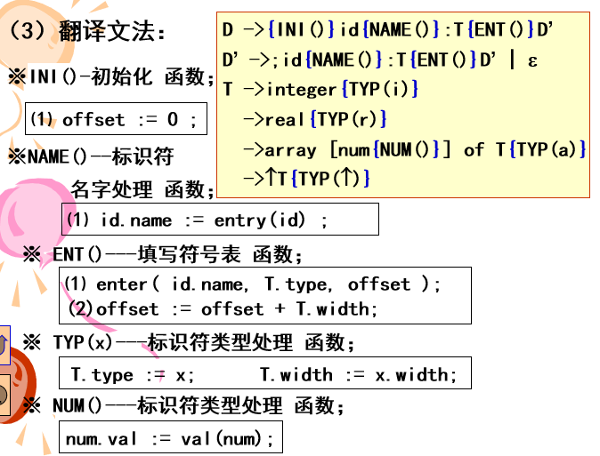
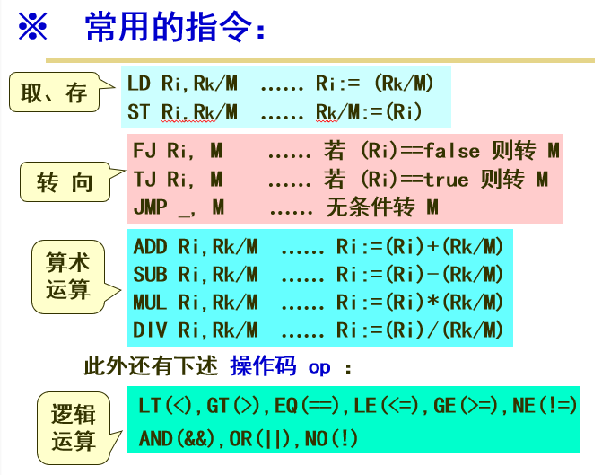

# 词法分析

词法分析程序，又称为扫描器，任务有二：

1. 识别单词
    - 从用户的源程序中把单词分离出来
2. 翻译单词
    - 把单词转换成机内表示，便于后续处理

## 单词分类

按照单词的语法功能可以分为如下四种：

1. 标识符
2. 常数
3. 关键字
4. 界符
    - 单字界符
    - 双字界符
    - 多字界符

> 如何区别关键字和标识符
>
> 现在，大多数编译程序使用“保留字”，即标识符不能用作关键字。系统预先造好关键字表，拼好的字符串，先查询“关键字”表，查到了视为关键字，否则，视为标识符。

## 单词的机内表示

机内表示可以使得：

1. 长短统一
2. 语法、语义信息分开

目前大多数采用如下二元式形式：

Token: | 类 - 值 |

- 类：语法信息，即单词的分类码
- 值：语义信息，如：数组维度，上下界，类型等

> 为提高分析效率，实践中，Token类码设计采用统一编码，如：标识符为 1，常数为 2，其余则一词一码，且从 3 编起。

## 一个简单词法分析器的实现

1. 识别器
    - 识别单词的 **有限状态自动机**
2. 翻译器
    - 根据 **有限状态自动机** 所识别出的对象，完成从单词串到单词的 Token 串的翻译。

## 算数常数处理机设计

带有翻译功能的自动机称为处理机，其结构可分为两个部分：

1. 识别器
    - 有限自动主机
2. 翻译器
    - 在自动机的状态节点处，插入翻译子程序

这里，字符型看作数值型处理。

算数常数基本形式：

``` antlr
Digit       : [0-9]
            ;
Integer     : (Digit)+
            ;
Float       : Integer ('.' Integer)? (e (+|-)? Integer)?
            ;
```

算法设计，设置如下参数：

- n：拼尾数值变量
    - 每当读入尾数数字d时候：`n = 10 * n + val(d)`
- p：拼指数值变量
    - 每当读入指数数字d时候：`p = 10 * p + val(d)`
- m：小数位数变量
    - 每当读入小数数字d时候：`m = m + 1`
- e：指数的符号变量
    - 有 `+` 或者无符号为 `1`，有 `-` 为 `-1`
- t：类型变量
    - 整型为 `0`，实型为 `1`

结果变量：

$$
num = n \times 10^{e \times p - m}
$$

> 参数初值分别为：n = p = m = t = 0，e = 1

# 语法分析

定义：形式上说，语法分析是指对给定的符号串（$\alpha$），判定其是否是某文法G(Z)的句子。

分类，语法分析方法通常分为两大类：

1. 自顶向下法（推导法）
    - 从开始符号出发，采用推导运算，试图自顶向下构造语法树。
    - 通常采用 **最左推导法**
2. 自底向上法（规约法）
    - 从给定的符号串出发，采用归约运算，试图自底向上构造语法树。
    - 通常采用 **最左归约法**

自顶向下分析的关键技术是如何确定有相同左部的产生式的候选者。

自底向上分析的关键技术是如何确定当前句型的句柄。

## 递归子程序的设计原理

语法分析的核心技术是文法的机内表示问题；递归子程序法直接把文法变成程序。

递归子程序法属于自顶向下语法分析方法。故又名递归下降法。

### 设计原理

对每一个非终结符，构造一个子程序，用以识别该非终结符所定义的符号串。每个子程序以产生式左部非终结符命名，以产生式右部构造子程序内容。

### 构造算法

1. 拓展文法：
    - 增设一个产生式，作为主程序：`S' -> S`
2. 入出口约定：
    - 子程序入口时，其首符号已经读取。
    - 子程序出口时，其后继符号应该已经读取。
3. 子程序内容设计：
    - 遇到终结符，判定之，确认后读取下一个单词；
    - 遇到非终结符，调用对应子程序，返回后不读取下一个单词；
    - 遇到空串（$\epsilon$），直接出口。

> 其中 3 的第二条规则最后不读取的原因是 2 的第二条规则中已经读取。

### 对文法的要求

递归子程序是根据文法各产生式的首符号与当前所读单词进行匹配，以决定候选产生式的；这要求文法有如下性质：

1. 具有相同左部的产生式，首符号不同
2. 文法不能有左递归

实际上，递归子程序要求的文法就是 `LL(1)` 文法。

## LL(1) 分析法

LL(1) 分析法是指从**左**到右扫描、最**左**推导，和只查看 `1` 个当前符号的意思。

LL(1) 分析法又称为预测分析法，与递归子程序法同属于自顶向下确定性语法分析方法。

LL(1) 分析法的基本要点有三：

1. 利用一个分析表，登记如何选择产生式的知识；
2. 利用一个分析栈，记录分析过程；
3. 文法必须是 LL(1) 文法

### 算法概要

> 设有文法 G(Z)，`#` 栈底标记和结束标记

1. 开始
    - 栈 `#Z`
    - Next(w)
2. 重复执行如下三个步骤，直到栈中只剩下 `#` 为止：
    1. 如果满足如下条件，栈先 POP 一个元素，然后将产生式右侧内容逆序 PUSH
        - 栈顶符号 为 `A`
        - 当前符号 为 `w = a`
        - 有产生式：A -> a $\alpha$
    2. 如果满足如下条件，栈先 POP 一个元素，然后 NEXT(w)
        - 栈顶符号 为 `a`
        - 当前符号 为 `w = a`
    3. 否则，错误处理！
3. 结束
    - 栈 `#`
    - 当前符号 `w = #`

### LL(1) 文法及其判定

定义：LL(1) 文法是指文法中，具有相同左部产生式，其选择集合不相交。

设有文法

$$
G(Z) = (V_N, V_T, Z, P),\space A \rightarrow \alpha \in P
$$

#### FIRST

first($\alpha$) 集合被定义为可从 $\alpha$ 推导得到的串的首符号的集合。其中 $\alpha$ 是任意的文法符号串。

$$
first(\alpha) = \{t | \alpha \Rightarrow^* t \dots, \space t \in V_T\}
$$

求 first 集合的算法简述：

执行如下规则直到再没有新的终结符号或者 $\epsilon$ 可以被加入到任何 first 集合中。

1. 如果 X 是一个终结符，那么 first(X) = X
2. 如果 X 是一个非终结符号，且 $X \rightarrow Y_1Y_2Y_3 \dots Y_k$ 是一个产生式，其中 $k \geq 1$，那么如果对于某个 i，a 在 first($Y_i$) 中，且 $Y_1Y_2Y_3 \dots Y_{i-1} \Rightarrow^* \epsilon$。那么把 a 加入 first(X)中。
3. 如果 X 是一个非终结符号，且有 $X \rightarrow^* \epsilon$，那么将 $\epsilon$ 加入到 first(X) 中。

#### Follow

对于非终结符号 A，follow(A) 被定义为可能在某些句型中紧跟在 A 右边的终结符号的集合。

$$
follow(A) = \{t | Z \Rightarrow^* \dots At \dots, t \in V_T\}
$$

求 follow 集合的算法简述：

执行如下规则直到再没有新的终结符号可以被加入到任何 follow 集合中。

1. 将 # 加入到 follow(Z) 中，其中 Z 是开始符号，而 # 是输入串的结束符号。
2. 如果存在一个产生式 $A \rightarrow \alpha B \beta$，那么 first($\beta$) 中除了 $\epsilon$ 之外的所有符号都在 follow(B) 中。
3. 如果存在一个产生式 $A \rightarrow \alpha B$，或者存在产生式 $A \rightarrow \alpha B \beta$ 且 first($\beta$) 包含 $\epsilon$，那么 follow(A) 中的所有符号都在 follow(B) 中。

#### SELECT

接下来是select集合的定义：

如果 $\alpha \Rightarrow^* \epsilon$

$$
select(A\rightarrow \alpha) = first(\alpha) \cup follow(A)
$$

如果 $\alpha \not\Rightarrow^* \epsilon$

$$
select(A\rightarrow \alpha) = first(\alpha)
$$

> 1. 如果 $\alpha = \epsilon$ 则 $first(\alpha) = \emptyset$
> 2. 设 # 为输入串的结束符号，则 $\# \in follow(Z)$

### 设计实现

#### LL(1) 分析表构造

||a  |...|#|
|-|---|---|-|
|Z| 1 |   | |
|A|   | 4 | |

表信息：

行：非终结符

列：终结符 | #

表项：产生式的序号

> 应用时，可用下列函数查表，获取相应产生式：
> L(栈顶符号，当前符号) = 产生式符号

#### 算法实现

按照算法概要完成算法实现。

## LR 分析法

LR 分析法是指从左到右扫描、最左规约的意思，它属于自底向上分析方法。

常用的算法有 LR(0) 和 LR(1) 等。其中括号内的数字指的是产看接下来 n 个符号，即可确定当前句型的句柄。

LR 分析法基本的要点有三：

1. 利用一个分析表，登记选择句柄产生式的知识
2. 利用一个分析栈，记录分析过程
3. 依次读取单词，并进行如下操作：
    - 当栈顶出现句柄时，选择规约
    - 否则移进

### 有限自动机用作句柄识别器

如何确认句柄

- 句柄一定出现于某一个产生式的右部
- 是否是句柄还要看其所在符号串中的位置

句柄识别器的构造方法

1. 拓展文法，使得文法符号附有位置信息：
    - 首先增设一个产生式（Z' -> Z，Z为开始符号)
    - 把产生式右端符号顺序编码，作为位置（状态）信息
    


2. 利用拓展文法构造句柄识别器：
    - 若把拓展文法中位置号看成状态，那么就可用有限自动机描述：
        1. 对每个产生式，构造自动机，用以识别自己的符号串；
        2. 设编码 `0` 作为自动机的开始状态，则
            - 第一个产生式，构造自动机：$\delta(0, Z) = 1$
                - 表示 `0` 状态“预见” Z 后变换为 `1` 状态
            - 第二个产生式，构造自动机
                - $\delta(0, a) = 2$
                - $\delta(2, B) = 3$
                - $\delta(3, A) = 4$
                - $\delta(4, d) = 5$
        3. 预见某个非终结符，也就预见其所有产生式的头符号；于是各产生式的子自动机可以并接在一起。


句柄识别器又称为“活前缀图”：意思是在最左归约中，识别了句柄，实际上也就识别了以句柄为后缀的该句型（规范句型）的前部符号串。

### LR(0) 分析器设计

LR(0) 中的 0 是指不必查看当前符号就可确认句柄之意。

LR(0) 分析法要求的文法应该是 LR(0) 文法。

LR(0) 文法满足下述特点：

1. 句柄识别器中，移进和归约不冲突；即移进和归约不同时发生！
2. 归约时，不必查看当前符号。

#### LR(0) 分析表构造

算法：

1. 拓展文法，构造句柄识别器
2. 根据句柄识别器，填写 LR(0) 分析表
    1. 若 $\delta(i, x) = k, \space x \in (V_N + V_T)$，则 $R(i, x) = xk$
    2. 若状态 $i$ 标记有归约 $r(j)$，则对任何 $a \in (V_T + \{ \# \})$，则 $R(i, a) = r(j)$
    3. $R(1, \#) = ok$
3. 程序设计如下：
    1. 开始栈情况为 `#0`
    2. NEXT(w)
    3. 查表 R(xk, w) = ?
        - 若 R 为空，错误！
        - 若 R 为 ok，结束
        - 若 R 为 wi，移进 wi，跳转到步骤 2
        - 若 R 为 r(j)，归约步骤如下，然后跳转到步骤 3
            - 取 $A \rightarrow \alpha$ (j)
            - POP($\alpha$)，也即弹出产生式右侧内容
            - 若 R(xk, A) = Ai，则 PUSH(Ai)

xk 栈顶文法出现。

### SLR(1) 分析法

LR() 分析法的关键技术是句柄识别器的设计问题，如果句柄识别器发生了冲突，此时 LR(0) 分析法失效。

而 SLR(1) 分析法实际上是在 LR(0) 分析法基础上，在冲突部分，向前看一个单词，并配合 follow 集合分析接下来是归约还是移进，使用哪个产生式归约。

### 简单优先分析法

简单优先分析法是一种从左到右扫描，最左规约的分析法；它属于自底向上分析法。

该方法利用文法符号之间的优先关系，来确定待归约的句柄，即可确定当前句型的句柄。

简单优先分析法的基本点有三：

1. 利用一个分析表，登记选择句柄产生式的知识；
2. 利用一个分析栈，记录分析过程；
3. 依次读取单词，并进行如下操作：
    - 当栈顶出现句柄时，规约之
    - 否则移进

#### 优先关系确定

从文法中获取优先关系

设 si，sj 是两个文法符号；

1. si == sj，当且仅当有 U -> ... si sj ...;
2. si <· sj，当且仅当有 U -> ... si W ...，且 W $\Rightarrow^+$ sj ...; 
2. si ·> sj，当且仅当有 U -> ... V sj ...，且 V $\Rightarrow^+$ ... si;

头符号集合和尾符号集合：

设 $A \in V_N$，si，sj 是两个文法符号，则：

- FirstVT(A) = {si | A $\Rightarrow^+$ si ...}
- LastVT(A) = {sj | A $\Rightarrow^+$ ... sj}

绘制出优先矩阵，如果一个格子中有一个以上符号，则不能用该分析法。

简单优先文法满足下述特点：

1. 文法产生式没有相同左部
2. 文法符号之间至多有一种优先关系

#### 分析算法

设 $W, V \in V_N$，si，sj 是两个文法符号；

1. 设置栈为 `#`
2. NEXT(w)
3. 查表 R(xk, w) = ?
    - R 为空，错误
    - R 为 ·> 归约，跳转到步骤 3
        1. 从 sj （栈顶符）开始，往栈内查找，找到第一个使得 `si-1 <· si` 的 si（句柄的头）
        2. 用 `si si+1 ... sj` 去查文法产生式，如果有 `A -> si si+1 ... sj`，则将产生式右侧内容 POP 出，并 PUSH(A)
    - R 不为 ·> 移进 w，跳转到步骤 2

#### 算符文法

只考虑算符之间的优先关系。

设有一文法 G，如果 G 中没有形如 `A -> ...QR ...` 的产生式，其中 Q 和 R 均为非终结符，则称该文法为算符文法（OG 文法）

头符号集合和尾符号集合定义如下：

设 $a \in V_T$，$P,R \in V_N$ 是两个文法符号，则：

FirstVT(P)={a| P $\Rightarrow^+$ a ... 或 P $\Rightarrow^+$ R a ...}, 

LastVT(P) ={a| P $\Rightarrow^+$ ... a 或 P $\Rightarrow^+$ ... a R}。 

算符优先关系定义如下：

设 $a,b \in V_T$，$P,Q,R \in V_N$，则：

1. a == b，当且仅当有 P -> ... a b ...， 或 P -> ... a Q b ...;
2. a <· b，当且仅当有 P -> ... a R ...， 且 R $\Rightarrow^+$ b ... 或 R $\Rightarrow^+$ Q b ...; 
2. a ·> b，当且仅当有 P -> ... R b ...， 且 R $\Rightarrow^+$ ... a 或 R $\Rightarrow^+$ ... a Q;

如果算符文法G中的任何一对终结符a和b之间，仅满足上述一种关系，则G就是一个算符优先文法（OPG）。

# 中间代码及其翻译

中间代码是高级程序语言中，各种语法成分的语义结构表示；它介于源语言和目标语言之间。

中间代码设置的目的是便于编译的后期处理，如优化和目标生成。

## 逆波兰式

表达式的逆波兰式设计：

设 pos(E) 为表达式 E 的逆波兰式：

1. pos($E_1 \omega E_2$) = pos($E_1$) pos($E_2$) $\omega$
2. pos((E)) = pos(E)
3. pos(i) = 1

其中，$\omega$ 为运算符，i 为运算对象。

> 以上三个定义式是逆波兰式翻译法则
> 
> 定义式中的 $\omega$ 为 $E_1 \omega E_2$ 中最后运算的算符

其他语法成分，例如：

1. 单目运算的逆波兰式
    - pos(-E) = pos(E) 或 0 pos(E) -
2. 赋值语句的逆波兰式
    - pos(v = E) = v pos(E) =

认为 `=` 号最后计算，`-` 号最先计算。

## 四元式

### 1 表达式的四元式设计

基本形式：

q: ($\omega$, object1, object2, result)

也即，算符，对象1，对象2，结果

设 quat(E)，res(E) 分别为表达式 E 的四元式和结果变量。

1. quat($E_1 \omega E_2$) =>
    - quat($E_1$)
    - quat($E_2$)
    - q: ($\omega$, res($E_1$), res($E_2$), ti)
2. quat((E)) =>
    - quat(E)
3. quat(i) =>
    - 空
4. res(i) =>
    - i

以上定义的定义式是四元式翻译法则，其中符号和逆波兰式定义一样，算符也是最后运算的算符。

四元式生成要点：按照运算法则，依次生成四元式。

### 2 赋值语句的四元式设计

设有赋值语句 `v = E`

则有

- quat(v = E) =>
    - quat(E)
    - q: (=, res(E), _, v)

### 转向语句和语句标号的四元式设计

- quat(goto i) =>
    - q: (gt, _, _, i)
- quat(i: S) =>
    - q: (lb, _, _, i)
    - quat(S)

### 条件语句的四元式设计


### 循环语句的四元式设计


### 逆波兰式计算过程

设置一个栈，每当 NEXT(w) 重复执行：

1. 若 w = 运算对象，则压入栈中暂存：PUSH(w)
2. 若 w = 运算符，则弹出栈顶对象，计算，并把结果压栈

## 中间代码翻译

### 属性文法

定义：属性文法是上下文无关文法在语义上的拓展，可以定义为如下三元组：

`A = (G, V, E)`

其中：G（文法），V（属性集），E（属性规则集）

说明：

1. 属性内容
    - 代表与文法符号相关的信息，这里主要指语义信息（类型、种类、值和值地址 ...）
    - 文法产生式中的每个文法符号都有若干个这样的属性
2. 属性可以进行计算和传递，属性规则就是在同一产生式中，相互关联的属性求值规则。
3. 属性分两类（按属性求值规则区分）
    - 综合属性：其值由子女属性值来计算（自底向上求值）
    - 继承属性：其值由父兄属性值来计算（自顶向下求值）

### 语法制导

定义：语法制导（syntax directed）是指根据语言的形式文法对输入序列进行分析、翻译处理，核心技术是构造翻译文法——在源文法产生式中，插入语义动作符号（翻译子程序），借以指明属性文法中属性求值时机和顺序。

### 翻译文法构造




# 优化

## 基本块划分

1. 找出基本块的入口语句：
   1. 程序的第一个语句
   2. 转向语句转移到的语句
   3. 紧跟在转向语句后面的语句
2. 对每一个入口语句，构造其所属的基本块
   1. 从该入口语句到另一入口语句之间的语句序列
   2. 从该入口语句到另一转移语句（或停止语句）之间的语句序列

## 优化的基本算法设计

1. 常值表达式节省
   1. 先进行常值计算
   2. 取常值的变量以常值代替之
2. 公共表达式
   1. 找公共表达式，建立结果变量等价关系
   2. 等价变量以老变量代替新变量
3. 删除无用赋值
   1. 确认一个变量的两个赋值点无引用点
   2. 则前一赋值点为无用赋值

## 基于 DAG 的局部优化方式

DAG 是指无环有向图，这里用来对基本块内的四元式序列进行优化


# 生成目标代码

大多数编译程序不产生绝对地址的机器代码，而是以汇编语言程序作为输出使代码生成阶段变得容易。此外，指令集的选择以及指令的执行速度问题都是重要因素。为了使算法具有通用性，这里采用的是：

虚拟机及其指令系统：

- 虚拟机寄存器
  - R0，R1，...，Rn-1
- 虚拟机指令系统
  - 指令的基本形式
    - op Ri, Rk/M
    - 含义： Ri = Ri op Rk 或者 Ri = Ri op M



## 活跃信息

变量的定义点和应用点

设有四元式：q: ($\omega$, B, C, A)

该四元式是 B、C 的应用点，是 A 的定义点。

- 活跃变量
  - 一个变量从某时刻起到下一个定义点位置，期间若有应用点（q），则称该变量在q是活跃的（y）
  - 否则称该变量在q是非活跃的（n）

我们是在一个基本块内讨论变量的活跃信息的，为了处理方便，假定：

1. 临时变量在基本块出口后是非活跃的（n）
2. 非临时变量在基本块出口后是活跃的（y）

### 标记活跃信息

表 symtbl 记录当前各个变量的活跃信息

1. 初值：基本块内各个变量分别设置为如下值
   - 若 X 为非临时变量，则设置 X（y）
   - 若 X 为临时变量，则设置 X（n）
2. **逆序**扫描基本块内各四元式，执行
   - 四元式中，A = symtbl(A)
   - symtbl(A) = n
   - 四元式中，B = symtbl(B)，C = symtbl(C)
   - symtbl(B) = y，symtbl(C) = y

### 寄存器分配方法


1. 一个变量在同一时刻只能占有一个寄存器！
2. 基本块出口时，寄存器中的活跃信息应保持其值

### 目标代码生成问题

1. 基本块开始时候，所有寄存器应该是空闲的。结束时，应释放所占用的寄存器。
2. 一个变量被赋值时候，要分配一个寄存器保留其值，并要修改寄存器保存值的记录
